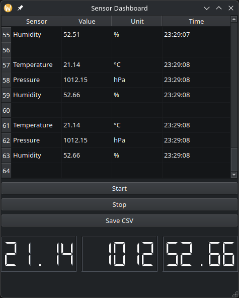

# Sensor Dashboard

**Sensor Dashboard** is a desktop application written in **C++17** and **Qt 6** for simulating and visualizing real-time sensor data.  
The project demonstrates practical C++ programming, object-oriented design, and GUI development using the **Qt Widgets** framework.

---

## Interface Preview



---

## Features
✅ Simulation of three sensors:
- Temperature (°C)  
- Pressure (hPa)  
- Humidity (%)  

✅ Real-time data updates (1 Hz)  
✅ Trend chart (`QChartView`)  
✅ Live LCD indicators (`QLCDNumber`)  
✅ Measurement log (`QTableWidget`)  
✅ Data export to CSV  

---

## Technologies & Tools

| Layer | Technologies |
|--------|--------------|
| Language | **C++17** |
| Framework | **Qt 6 (Widgets, Charts)** |
| Build System | **CMake 3.16+** |
| Programming Concepts | OOP, Signals & Slots, RAII |
| Other | STL (`<random>`, `std::vector>`), MVC |

---

## Project Structure
```
src/
├── main.cpp
├── mainwindow.h/.cpp
├── chartwidget.h/.cpp
├── sensorsimulator.h/.cpp
├── sensor.h/.cpp
ui/
└── mainwindow.ui
```

---

## Build & Run

### Requirements
- **Qt 6.x** with `Charts` module  
- **CMake ≥ 3.16**  
- **C++17-compatible compiler**  

### Linux / macOS
```bash
git clone https://github.com/r-lapins/SensorDashboard.git
cd SensorDashboard
mkdir build && cd build
cmake ..
make
./SensorDashboard
```

### Windows (Qt Creator)
1. Open CMakeLists.txt in Qt Creator
2. Select Qt 6 kit
3. Build → Run

---

## Example CSV Export
```
Sensor,Value,Unit,Time
Temperature,21.45,°C,12:45:02
Pressure,1016.8,hPa,12:45:02
Humidity,49.3,%,12:45:02
```
